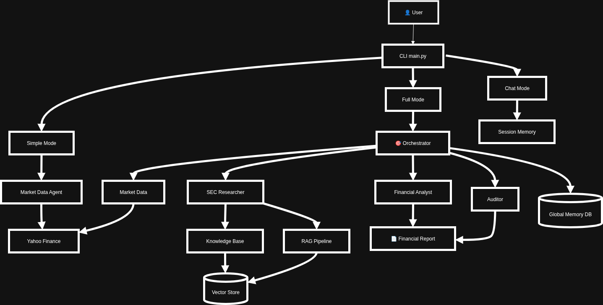

# 🤖 Multi-Agent Financial Analysis System

A production-ready multi-agent system for analyzing US-listed companies using SEC 10-K filings and real-time market data.

## 🎯 Features

- **Advanced Agentic RAG**: Hybrid search (dense + sparse), query decomposition, cross-document comparison, and re-ranking
- **Multi-Agent Orchestration**: Coordinated workflow with specialized agents
- **Dual Memory System**: Global (persistent) and session (ephemeral) memory
- **Real-time Market Data**: Live quotes, market cap, fundamentals from Yahoo Finance
- **Citation Tracking**: Every claim traced back to source with provenance
- **Production Features**: Structured logging, cost tracking, Docker deployment, comprehensive tests

---
## Architecture Diagram

## 🏗️ Architecture

### Agent Roles

1. **Orchestrator**: Query planning and agent coordination
2. **SEC Researcher**: Advanced RAG over 10-K filings with cross-year analysis
3. **Market Data Agent**: Real-time metrics from Yahoo Finance API
4. **Financial Analyst**: Synthesizes findings into markdown briefs
5. **Auditor**: Verifies citations and numeric accuracy
6. **Memory Manager**: Manages persistent and ephemeral state

### Technology Stack

- **Framework**: phidata for agent orchestration
- **LLM**: OpenAI GPT-4o / Anthropic Claude
- **Vector DB**: PostgreSQL + pgvector
- **Cache**: Redis for session memory
- **Market Data**: yfinance (Yahoo Finance API)
- **Deployment**: Docker + docker-compose

---

## 🚀 Quick Start

### Prerequisites

- Python 3.10+
- Docker & Docker Compose
- OpenAI API key

### Installation

```bash
# 1. Clone repository
git clone <your-repo-url>
cd financial-agent-system

# 2. Create virtual environment
python -m venv venv
source venv/bin/activate  # On Windows: venv\Scripts\activate

# 3. Install dependencies
pip install -r requirements.txt

# 4. Setup environment variables
cp .env.example .env
# Edit .env and add your OPENAI_API_KEY

# 5. Start PostgreSQL and Redis
docker-compose up -d postgres redis

# 6. Initialize database
python -m core.knowledge_base init

# 7. Index 10-K filings (example: NVDA last 5 years)
python data/seed_data.py --ticker NVDA --years 5
```

### Run Analysis

```bash
# Analyze a company
python main.py analyze NVDA

# Interactive chat mode
python main.py chat NVDA --user-id your_user_id

# With custom preferences
python main.py analyze AAPL --new-session
```

---

## 📊 Example Output

```markdown
# Financial Analysis: NVDA
*Generated: 2025-10-02T14:30:00Z*

---

## Executive Summary

NVIDIA Corporation (NVDA) demonstrates strong growth driven by AI/ML chip demand, 
with revenue increasing 126% YoY to $60.9B in FY2024 [NVDA 10-K 2024, Item 7]. 
Current market cap of $3.2T reflects premium valuation...

---

## Current Market Metrics

| Metric | Value |
|--------|-------|
| **Current Price** | $1,245.67 |
| **Market Cap** | $3,200,000,000,000 |
| **Shares Outstanding** | 2,570,000,000 |
| **52-Week Range** | $892.10 - $1,350.45 |
| **P/E Ratio** | 68.5 |

*Source: Yahoo Finance, 2025-10-02T14:30:00Z*

---

## Key Risk Factors

**Technology & Competition**
- Rapid technological change requires continuous innovation [NVDA 10-K 2024, Item 1A]
- Increasing competition from AMD, Intel, and cloud providers [NVDA 10-K 2023, Item 1A]

**Supply Chain**
- Dependence on TSMC for chip manufacturing [NVDA 10-K 2024, Item 1A]
- Geopolitical tensions affecting Taiwan operations [NVDA 10-K 2024, Item 1A]

...
```

---

## 🧠 RAG Strategy

Our advanced retrieval pipeline goes beyond naive top-k vector search:

### 1. Query Decomposition
Complex questions are broken into focused sub-queries:
```
Query: "Compare NVDA's AI revenue growth to competitors over 5 years"
↓
Sub-queries:
- "NVDA AI revenue 2020-2024"
- "AMD AI revenue 2020-2024"  
- "Intel AI revenue 2020-2024"
```

### 2. Hybrid Search
Combines dense (semantic) and sparse (keyword) retrieval:
- **Dense**: Sentence-BERT embeddings for semantic similarity
- **Sparse**: BM25 for exact keyword matching
- **Fusion**: RRF (Reciprocal Rank Fusion) to merge results

### 3. Re-ranking
Cross-encoder model re-scores candidates for relevance:
```python
# Initial retrieval: 20 candidates
# Re-ranking
=======


